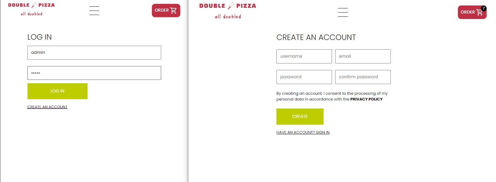
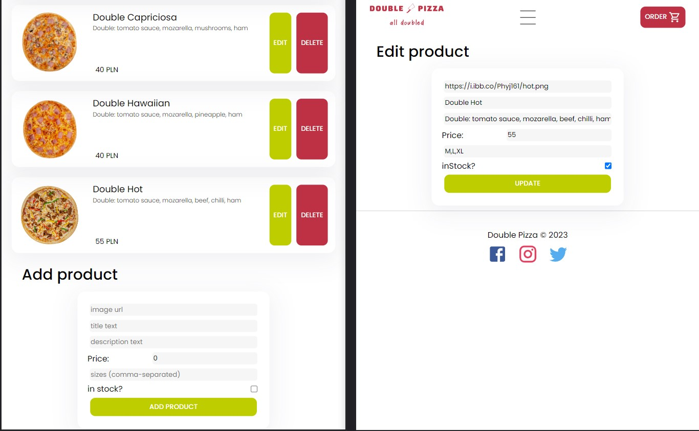
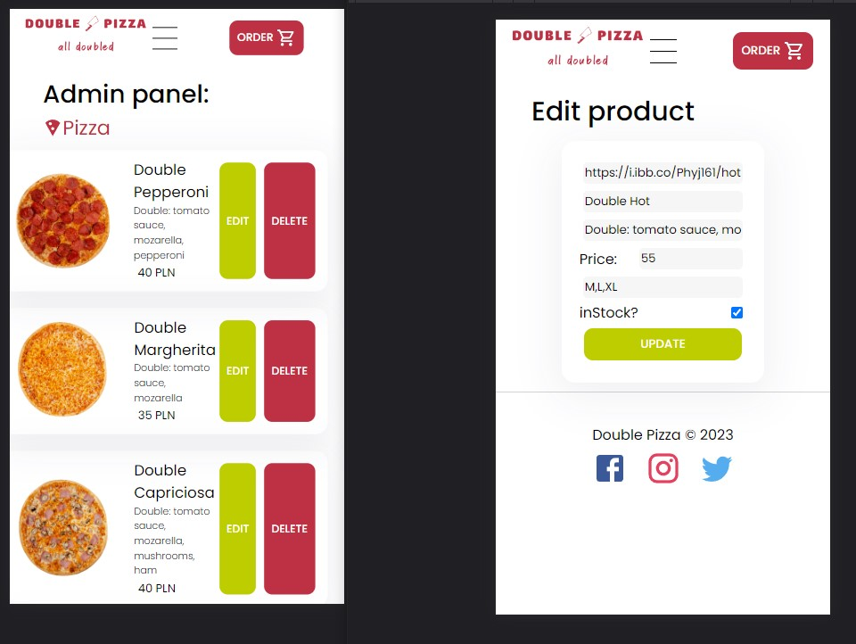

# Double Pizza
React ordering pizza app.

## Table of contents
- [Live](#live)
- [How To Install](#how-to-install)
- [Technologies](#technologies)
- [Functionalities](#functionalities)
- [Screens](#screens)

## Live
https://double-pizza.netlify.app/

## How To Install

- open code editor,
- open terminal and navigate to folder where You want project copied,
- clone project through terminal with command: "git clone https://github.com/Zasada94/pizza-portal/",
- use "cd pizza-portal" (change direction) command to get into apps main folder,
- install dependencies with npm command through terminal: "npm install",
- start app live version with "npm run dev" command.
- NOTE: to fully functioning login and admin-panel it's necessary to install backend api from: "https://github.com/Zasada94/pizza-ordering" and use Your own .env hidden data.
  
## Technologies

Project was created with:

- React
- styled components
- materialUI
- redux
- mongoDB
- node.js
- express
- mongoose
- .env

## Functionalities

- choosing and ordering pizzas. Products are get from database and orders are posted to database.

## Screens
menu

cart

order

feedback

login and register

admin panel

menu mobile

cart mobile

order mobile

feedback mobile

login and register mobile

admin panel mobile

